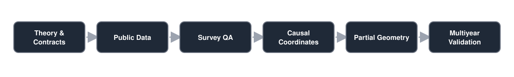

# Economic Geometry Research

A reproducible empirical research project investigating whether household economic purchasing power is better represented as a **multidimensional state** than as a single price index.

The working state includes dimensions such as consumption purchasing power, housing access, capital access, debt burden and income security. CPI and PCE remain valid consumer-price benchmarks; this project asks a different question: whether changes in household economic opportunity contain structure that a one-dimensional price measure cannot represent.

## Highlights

- Precommitted research stages with explicit GO/NO-GO gates and frozen interpretation boundaries.
- U.S. macroeconomic experiments spanning consumption purchasing power and housing access.
- Survey-engineering workflows across CE, SCF, CPS ASEC and ACS public data.
- Explicit handling of survey weights, replicate weights, multiple imputation and cohort definitions.
- Exact/rational arithmetic for the frozen 2022 partial-state descriptive geometry.
- Multiyear source-lineage and schema-comparability work before temporal geometry is allowed.
- Negative and inconclusive results are preserved instead of being optimized away.
- No scalar "Real Inflation" index, crisis predictor or causal model is currently claimed.

## Research pipeline

<p align="center">
  
</p>

## Research question

For household or cohort \(h\), the long-run objective is to define an economic-power state \(EP_h(t)\) rich enough to represent economically distinct constraints.

A future purchasing-power erosion quantity could conceptually be written as:

```text
pi_real_h(t) = - Delta ln(EP_h(t))
```

The operational definition of `EP_h(t)` is **not yet frozen**. No final scalar is authorized until the individual dimensions, survey estimators, robustness checks and multiyear replication survive their precommitted gates.

## Selected frozen findings

| Stage | Frozen result | Interpretation boundary |
| --- | --- | --- |
| E2A | Consumption and housing-access changes can move in opposite directions in the U.S. core sample. | This alone does not establish multidimensionality or causality. |
| E2B | The precommitted robustness attack did **not** fully survive. | The negative result is retained; H1 is not declared established. |
| E2D | BIC selected descriptive change points at 2008 and 2013 for the annual two-coordinate change vector. | These are statistical segments, not causal economic regimes. |
| E4C9 | A 2022 partial descriptive geometry was frozen for 8 state points using 5 numerical coordinates and two precommitted metrics. | No inferential geometry, PCA, welfare-loss ranking or inflation scalar was authorized. |
| E4D1 | Multiyear comparability and 2019 execution adapters are being validated before temporal geometry. | The public snapshot remains pre-scalar and pre-causal. |

The corresponding frozen public summaries are under [`results/selected/`](results/selected/).

## Scientific design

### Precommit before values

Many stages freeze schema, estimators, transformations, gates and interpretation rules before opening the values needed for the next empirical step. Repair stages distinguish engineering defects from scientific-method changes.

### Survey design is part of the model

Household coordinates derived from survey microdata are not treated as ordinary unweighted sample means. The project explicitly tracks survey weights, replicate designs, imputation structure, universes, reference-person linkage and estimator lineage.

### Fail closed on provenance

When a field binding, year label, source archive, static layout or predecessor hash cannot be established, the stage stops. The repository deliberately preserves failed attempts and repair contracts rather than silently substituting a convenient input.

### No post-hoc scalar

The project is not allowed to collapse the state into a final "Real Inflation" number merely because a geometric representation exists. Dimensional validity and temporal replication come first.

## Repository structure

```text
scripts/             executable research, audit and precommit stages
docs/                methodology, contracts and research boundaries
processed/           small public macro-level derived tables
results/selected/    curated frozen summaries and geometry outputs
tests/               public-repository integrity checks
data/metadata/       publication-boundary placeholder; local provenance is excluded
```

The original private research workspace also contains a large `data/raw/` tree and extensive generated provenance/audit metadata. Those files are intentionally not redistributed here.

## Reproducing the public checks

Python 3.12+ is recommended.

```bash
python3 -m venv .venv
source .venv/bin/activate
python -m pip install --upgrade pip
python -m pip install -r requirements.txt

python -m compileall -q scripts
python -m unittest discover -s tests -v
```

The full empirical pipeline requires the corresponding source datasets to be acquired from their original public authorities. Raw data is not bundled in this portfolio release.

## Selected documentation

- [Research target](docs/real_inflation_target.md)
- [Public research status](docs/RESEARCH_STATUS.md)
- [Architecture](docs/ARCHITECTURE.md)
- [Publication boundary](docs/PUBLICATION_BOUNDARY.md)
- [E2B robustness precommit](docs/E2B_robustness_precommit.md)
- [E2D change-point precommit](docs/E2D_change_point_precommit.md)
- [E4C7 metric-scale architecture](docs/E4C7_cross_coordinate_metric_scale_architecture_precommit.md)
- [E4C9 descriptive-geometry execution](docs/E4C9A_partial_state_descriptive_geometry_execution_precommit.md)

The deeper stage documents retain the original chronology and make the research lineage auditable.

## Current status

The project has progressed well beyond the early macro prototype into survey-estimator construction, partial-state geometry and multiyear comparability work. The latest public snapshot is still deliberately conservative:

- temporal full-state geometry is not authorized;
- a final scalar is not authorized;
- crisis prediction is not authorized;
- causal claims are not authorized.

That boundary is part of the research design, not an unfinished README disclaimer.

## License

The software and original documentation in this repository are licensed under the [MIT License](LICENSE).

Third-party datasets, source materials, agency content, trademarks and other third-party materials are not covered by this license and remain subject to their respective terms.

## Disclaimer

Independent research project. It is not affiliated with or endorsed by the U.S. government agencies, data providers or institutions referenced in the research.
